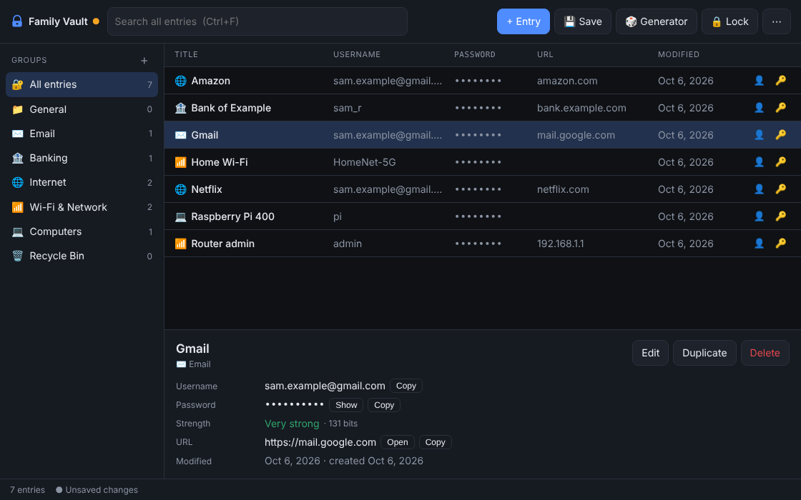

# Latch

An offline, KeePass-style password safe in a single HTML file.

## Use it
Download `index.html` and open it in Chrome, Edge, Firefox or Chromium (works on Raspberry Pi too). Nothing is sent over the internet.

- Create a vault with a master password, or open an existing `.latch` file
- Groups, recycle bin, password history, expiry dates
- Password generator and strength meter
- Clipboard auto-clear and auto-lock
- Import/export CSV (KeePass, Chrome and similar)

## Security
The vault is encrypted with AES-256-GCM using a key derived from your master password (PBKDF2-SHA256, 600,000 iterations). There is no way to recover a forgotten master password.
